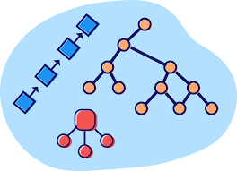

<!--- #eda_cpp --->

  

# Data Structures and Algorithms in C++

## Dependencies
- g++
- cmake
  
To make environment setting easy, we have relesed a Linux virtual machine with the dependencies already installed. You can download the VM from [here](https://www.dropbox.com/scl/fi/suhnm0ci3pj0xo80a71gm/EDAUAndes.ova?rlkey=9j3wswii81fdtnet3h2zmwpko&dl=0).

Please, to install the dependencies consult the Chapter 1 of the guide [book](https://www.dropbox.com/s/v3jeokz580z0amq/EDA_book.pdf).
## Compiling with CMake 
- cd [sort | misc]  (_go to the project folder_)
- mkdir build  (_create a build folder_)
- cd build
- cmake .. (_create makefiles. Remember, to use cmake you should have the CMakeLists.txt file_ )
- make  (_run make_)

## Running
- ./test  (_run executable_)

